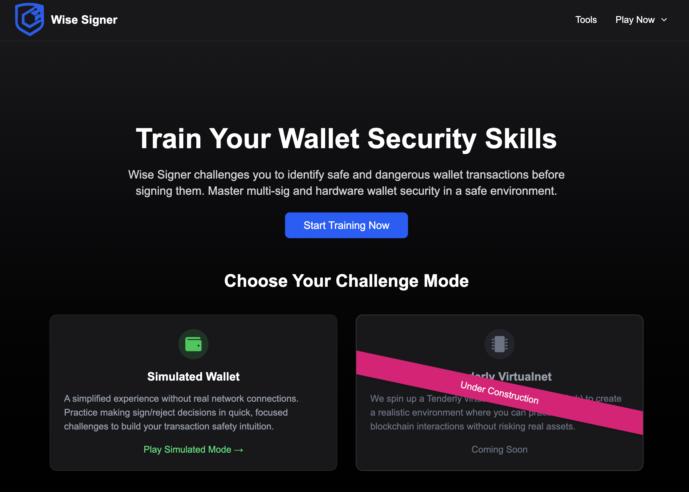

# Wise Signer

<div align="center">
  
  <h3>Train your wallet security skills in a safe environment</h3>
</div>

## About

Wise Signer is an educational platform designed to help Web3 users develop critical security skills for interacting with cryptocurrency wallets. Through interactive challenges and simulations, users learn to identify and avoid common security threats, phishing attempts, and deceptive transactions.

## Features

- **Simulated Wallet Mode**: Practice making sign/reject decisions in quick, focused challenges without real network connections.
- **Interactive Learning**: Engage with realistic scenarios that mimic common attack vectors and security threats.
- **Educational Resources**: Access a comprehensive collection of tools and resources related to wallet security.
- **Progressive Difficulty**: Learn at your own pace with challenges that gradually increase in complexity.
- **Transaction Verification Training**: Master the skills to verify transaction details in multi-signature wallets.

## Getting Started

### Prerequisites

- Node.js 18.0.0 or higher
- npm 8.0.0 or higher

### Installation

1. Clone the repository:

   ```bash
   git clone https://github.com/Cyfrin/wise-signer.git
   cd wise-signer
   ```

2. Install dependencies:

   ```bash
   npm install
   ```

3. Start the development server:

   ```bash
   npm run dev
   ```

4. Open [http://localhost:3000](http://localhost:3000) in your browser to see the application.

## Project Structure

```
./src
├── app                  # App Router pages and routing
│   ├── layout.tsx       # Root layout
│   ├── page.tsx         # Home page
│   ├── simulated        # Simulated wallet routes
│   ├── tenderly         # Tenderly routes (coming soon)
│   └── tools            # Tools & resources
├── components           # Reusable components
├── data                 # Data files and configurations
├── types                # TypeScript type definitions
└── utils                # Utility functions
```

## Security Topics Covered

- Multi-signature wallet verification
- Hardware wallet security
- Phishing detection
- Address poisoning attacks
- Malicious transaction identification
- Website security verification
- Smart contract interaction safety

## Tools and Resources

Wise Signer includes links to valuable resources for wallet security:

- Calldata decoders
- Safe{Wallet} transaction verifiers
- Educational videos
- Information about notable exploits and hacks

## Contributing

We welcome contributions to Wise Signer! Please see our [CONTRIBUTING.md](CONTRIBUTING.md) for details on how to get started.

## Future Development

- **Tenderly Virtualnet Mode**: A realistic environment using Tenderly virtual testnet for actual blockchain interactions without risking real assets.
- **Expanded Lessons**: Additional scenarios covering a wider range of security threats.
- **Security Certifications**: Earn certificates for completing training modules.

## License

This project is licensed under the [GNU Affero General Public License v3.0 (AGPL-3.0)](https://www.gnu.org/licenses/agpl-3.0.en.html) - see the [LICENSE](LICENSE) file for details.

The AGPL-3.0 license ensures that if you modify this software and use it to provide a service over a network, you must release your modifications under the same terms. This promotes open collaboration and ensures improvements remain accessible to the community.

## Acknowledgments

- Built by [Cyfrin](https://cyfrin.io)
- Inspired by the [Red Guild Phishing Dojo](https://phishing.therektgames.com/)

---

<div align="center">
  <strong>Stay safe in Web3</strong>
</div>

<!-- Simulated Wallet Challenges (leave for Updraft):
- EOA
  - Sign in with Ethereum (MetaMask side pop up) ✅
  - Basic ETH transfer (Trezor pop up) ✅
  - Aave Deposit (MetaMask side pop up) ✅
  - EIP-712 signature (MetaMask side pop up) ✅
- Smart contract wallet
  - Basic Token transfer, first signer (MetaMask & trezor side pop up)
    - Show
  - Token transfer with confusing phishing token (MetaMask & trezor side pop up)
  - EIP-712 signature (Trezor)
    - Do it correct, only show data
  - EIP-712 siganture (metamask)
    - Show EIP-712 raw

Connected Wallet Challenges:
- Tenderly setup (virtual testnet setup)
  - eternal safe setup
  - https://eternalsafe.eth.limo?chainId=84532&chain=Base%20Sepolia&shortName=base-sepolia&rpc=https%3A%2F%2Fsepolia.base.org&currency=ETH&symbol=ETH&expAddr=https%3A%2F%2Fsepolia.basescan.org%2Faddress%2F%7B%7Baddress%7D%7D&expTx=https%3A%2F%2Fsepolia.basescan.org%2Ftx%2F%7B%7Bhash%7D%7D&l2=true&testnet=true
- EOA - Oh no! Safe Wallet is down!
  - Uniswap swap
  - EIP-712 signature
- Smart contract wallet
  - Basic ETH transfer, first signer

# Tenderly game plan
- Options:
  - Create tenderly network from API Key, account name, and project name
    - Saves http endpoint to local storage
  - I already have a tenderly virtual network (connect, set/check chainId)
    - Save http endpoint to local storage

# Safe Wallet Game Plan...
1. User connects wallet
   1. Fund user wallet with 10 ETH
   2. Fund anvil5 address with 10 ETH
      1. https://virtual.sepolia.rpc.tenderly.co/2266f442-859b-4462-8195-99a709746ffe
  payload:
  ```
   {method: "tenderly_addBalance",…}
   id
   :
   3
   jsonrpc
   :
   "2.0"
   method
   :
   "tenderly_addBalance"
   params
   :
   [["ADDRESS_TO_FUND"], "0xde0b6b3a7640000"]
   0
   :
   ["ADDRESS_TO_FUND"]
   0
   :
   "ADDRESS_TO_FUND"
   1
   :
   "0xde0b6b3a7640000"
   ```
   1. Have user deploy custom Safe address for each question, as question 1, and save to local storage
   2. For each question, set 2/3 signers as:
      1. anvil5
      2. whatever wallet is connected
      3. anvil6
1. Question 2 is to setup eternalsafe with custom network, saying "oh no, the safe UI is down!!", can you connect?
2. Drop user to question 3


 -->
